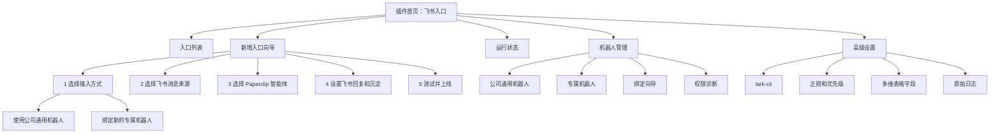
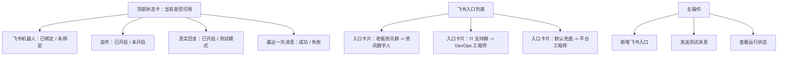
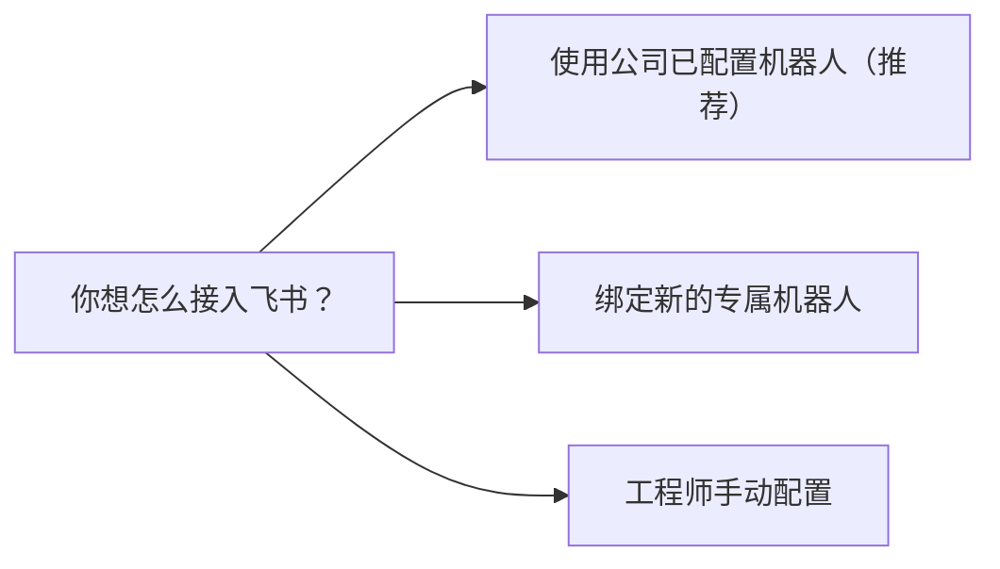
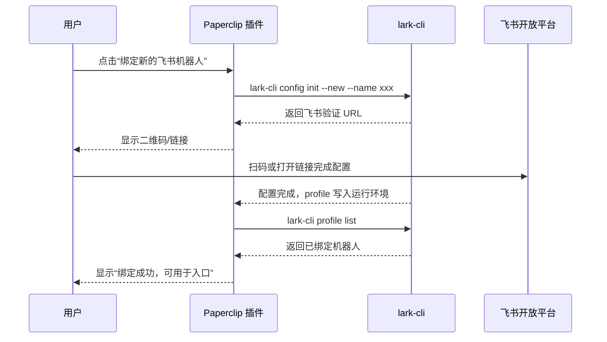

# 飞书连接器产品与界面重设计稿

状态：待确认  
目标读者：产品负责人、业务用户、Paperclip 研发、飞书集成工程师  
核心原则：普通用户配置“飞书入口”，管理员管理“飞书机器人”，工程师处理“高级字段”。

## 1. 产品定位

这个插件不应该被理解为“飞书 API 配置页”，而应该是：

> 把飞书里的某个群、某类消息、某个发起人，接到 Paperclip 的某个智能体，并把结果回到飞书。

因此主对象不是 App ID、Secret、profile、regex，而是“飞书入口”。

## 2. 用户故事

### 2.1 普通业务用户

用户目标：我希望在飞书里 @某个机器人，说一句需求，就自动交给某个智能体处理。

用户应该看到：

- 当前是否已经能用
- 用哪个飞书机器人
- 什么消息会进入 Paperclip
- 交给哪个智能体
- 智能体完成后怎么回飞书
- 一键测试

用户不应该看到：

- App Secret
- lark-cli 路径
- profile 名
- 正则表达式
- 规则优先级
- 飞书事件名
- Base token

### 2.2 业务负责人

用户目标：给不同业务场景配置入口，例如老板资讯群、客户需求群、IT 支持群。

需要能力：

- 查看所有入口
- 新增入口
- 暂停入口
- 修改入口交给哪个智能体
- 看每个入口最近是否有消息、是否创建任务、是否回飞书

### 2.3 企业管理员

用户目标：统一维护公司可用机器人，避免每个人重复创建飞书应用。

需要能力：

- 使用公司通用机器人
- 增加项目专属机器人
- 查看机器人权限状态
- 查看机器人监听状态
- 管理哪些入口使用哪个机器人

### 2.4 工程师

用户目标：兜底处理配置、权限、日志和故障。

需要能力：

- 手动 App ID / App Secret 绑定
- lark-cli profile 诊断
- 用户授权
- 事件订阅状态
- 正则、优先级、Base 字段映射
- 原始事件样本、失败日志

## 3. 总体信息架构



## 4. 页面一：飞书入口首页

页面目标：用户一眼知道“现在能不能用、哪些飞书入口在工作、怎么新增一个入口”。

### 4.1 页面结构



### 4.2 入口卡片展示

每张入口卡片只用业务语言：

```text
老板资讯群里的消息
当消息 @小锐 或包含“资讯”时
交给：刘总 - 锐捷网络总裁
完成后：在原飞书消息线程回复
沉淀：同步到“资讯需求池”多维表格
状态：运行中 · 最近 15:19 成功处理
```

按钮：

- 测试
- 编辑
- 暂停
- 查看记录

不在卡片上展示：

- route id
- regex
- priority
- profileName
- appId

## 5. 页面二：新增入口向导

页面目标：让非技术用户用 5 步完成配置。

### Step 1：选择接入方式



默认推荐：使用公司已配置机器人。

选择说明：

- 公司已配置机器人：普通用户用这个。
- 绑定新的专属机器人：部门、项目、老板专属机器人用这个。
- 工程师手动配置：只在官方向导不可用时兜底。

### Step 2：选择飞书消息来源

字段：

- 飞书机器人：下拉选择
- 飞书群/会话：搜索选择
- 触发方式：
  - @机器人
  - 指定关键词
  - 指定发起人
  - 接收该群所有消息
- 附件处理：
  - 接收图片
  - 接收文件
  - 接收音视频

默认建议：

- 群聊入口：必须 @机器人 或包含关键词，避免把普通聊天全部变成任务。
- 单聊入口：默认接收所有消息。

### Step 3：选择 Paperclip 智能体

字段：

- Paperclip 公司：下拉选择
- 智能体：下拉选择
- 任务标题模板：默认自动生成
- 任务描述模板：默认包含飞书来源、发起人、原始消息、附件

普通用户只需要选公司和智能体。

### Step 4：设置回复和沉淀

字段：

- 收到后是否先回复“已收到”
- 完成后怎么回复：
  - 原消息线程回复（推荐）
  - 发送新消息
  - 不自动回复
- 是否写入多维表格：
  - 不写入
  - 选择已有需求池
  - 新增多维表格写入规则

### Step 5：测试并上线

测试项目：

- 能收到飞书消息
- 能创建 Paperclip 任务
- 能唤起目标智能体
- 能把完成结果回到飞书
- 如果配置了多维表格，能写入记录

上线前页面给一个明确结论：

```text
可以上线：在“张腾的智能体团队”群里 @小锐 发送“只回复 ok”，会由刘总处理并在原线程回复。
```

## 6. 页面三：飞书机器人管理

页面目标：企业管理员维护可用机器人，普通用户只选择，不管理。

### 6.1 机器人列表

字段：

- 显示名称
- 类型：公司通用 / 项目专属 / 个人测试
- 飞书应用 App ID
- 授权用户
- 监听状态
- 权限状态
- 正在使用的入口数量

操作：

- 设为默认机器人
- 重新授权
- 权限检查
- 暂停监听
- 删除绑定

### 6.2 绑定新机器人

主路径：



兜底路径：

- App ID
- App Secret
- profile 名
- brand：feishu / lark

兜底路径默认折叠为“工程师手动绑定”。

## 7. 页面四：授权中心

页面目标：区分“机器人授权”和“用户授权”。

### 7.1 机器人授权

用于：

- 收飞书消息
- 发飞书消息
- 下载消息附件
- 写多维表格

这是本插件 MVP 的默认授权方式。

### 7.2 用户授权

用于：

- 搜用户可见的聊天记录
- 访问用户个人文档
- 访问用户日历、邮箱、审批

用户授权不应该默认打开。只有业务明确要求“代表某个人访问他的个人数据”时，才引导 `auth login`。

## 8. 页面五：运行状态与诊断

页面目标：用户知道为什么没生效，工程师能定位。

面向普通用户显示：

- 监听是否开启
- 测试模式是否关闭
- 最近一次收到的飞书消息
- 最近一次创建的 Paperclip 任务
- 最近一次飞书回复

面向工程师展开：

- lark-cli 路径
- lark-cli 版本
- profile list
- auth status
- event subscriber PID
- 原始飞书事件
- 最近 50 条日志

## 9. 页面六：高级设置

默认折叠，只给工程师。

包括：

- lark-cli 命令路径
- dryRunCli
- enableEventSubscriber
- eventTypes
- quickReplyRegex
- quickReplyText
- route priority
- route regex
- base fieldMap
- raw config JSON

## 10. 配置模型

建议把当前模型在 UI 上重新命名，不一定立刻改底层字段。

| UI 概念 | 当前底层字段 | 说明 |
| --- | --- | --- |
| 飞书机器人 | `connections[]` | 对应一个 lark-cli profile / Feishu app |
| 飞书入口 | `routes[]` | 对应一条消息进入 Paperclip 的规则 |
| 多维表格沉淀 | `baseSinks[]` | 对应一个 Base 写入目标 |
| 运行方式 | `dryRunCli`, `enableEventSubscriber`, `ackOnInbound` | 是否真实发送、是否监听、是否先回复 |
| 工程师高级 | `larkCliBin`, `eventTypes`, `quickReplyRegex` | 默认不展示 |

建议新增 UI 聚合结构：

```ts
type FeishuEntryViewModel = {
  id: string;
  title: string;
  enabled: boolean;
  robotName: string;
  sourceSummary: string;
  targetCompanyName: string;
  targetAgentName: string;
  replySummary: string;
  baseSinkSummary?: string;
  health: "ready" | "needs_attention" | "paused" | "error";
};
```

## 11. 能力支撑矩阵

| 设计能力 | 是否可支撑 | 支撑来源 | 备注 |
| --- | --- | --- | --- |
| 自定义插件配置页 | 可以 | Paperclip `settingsPage` UI slot | 当前插件已使用 |
| UI 读取状态与列表 | 可以 | `usePluginData` / `ctx.data.register` | 已有 `status`、`catalog`、`profiles` |
| UI 触发绑定、测试、诊断 | 可以 | `usePluginAction` / `ctx.actions.register` | 已有 `bindProfile`、`startGuidedBind`、`simulateInboundMessage` |
| 读取 Paperclip 公司和智能体 | 可以 | `ctx.companies.list`、`ctx.agents.list` | 当前 `catalog` 已实现 |
| 创建 Paperclip 任务 | 可以 | `ctx.issues.create` | 当前入站处理已实现 |
| 唤起智能体处理 | 可以 | `ctx.agentSessions.create/sendMessage` 或 `ctx.agents.invoke` | 当前已使用 agent session |
| 附件进入任务 | 可以 | 飞书资源下载 + `ctx.issues.attachments.create` | 当前已支持 image/file/audio/video 资源下载逻辑 |
| 飞书官方绑定向导 | 可以 | `lark-cli config init --new` | 本机 `lark-cli 1.0.19` 支持 |
| 手动绑定 App ID / Secret | 可以 | `lark-cli profile add --app-secret-stdin` | 当前已实现 |
| 列出已绑定机器人 | 可以 | `lark-cli profile list` | 当前已实现 |
| 搜索飞书群 | 可以 | `lark-cli im +chat-search` | 可做“选择群聊”下拉/搜索 |
| 搜索飞书用户 | 可以 | `lark-cli contact +search-user --as user` | 需要用户授权有效 |
| 接收飞书消息 | 可以 | `lark-cli event +subscribe` + `im.message.receive_v1` | 当前已支持长连接监听 |
| 回复飞书消息 | 可以 | `lark-cli im +messages-reply` | 当前已实现 |
| 发送飞书消息 | 可以 | `lark-cli im +messages-send` | 当前已实现 |
| 写入飞书多维表格 | 可以 | `lark-cli base +record-upsert` | 当前已实现 |
| 用户授权 | 可以 | `lark-cli auth login --no-wait` / `--device-code` | 需要单独做授权页 |
| 扫码后列出用户拥有的所有飞书应用/机器人 | 不应作为 MVP 承诺 | 当前 `lark-cli`/常规机器人权限不等于开发者后台应用管理权限 | 可以作为未来增强，不能阻塞主流程 |

## 12. MVP 改造范围

第一阶段只做 UI 和少量 action 增强：

1. 把主页面从“配置项表单”改为“飞书入口列表”。
2. 增加“新增入口向导”。
3. 把机器人绑定从主流程挪到“机器人管理”。
4. 把 App ID、Secret、lark-cli、regex、priority、Base fieldMap 全部移入高级。
5. 增加“一键测试入口”，测试飞书收到、Paperclip 创建任务、飞书回复。

不做：

- 不承诺扫码后列出用户拥有的所有开放平台应用。
- 不默认开启用户授权。
- 不把所有飞书文档/日历/邮箱能力塞进这个插件。

## 13. 研发拆分建议

### 13.1 UI 重构

- `FeishuSettingsPage` 拆成：
  - `EntryOverview`
  - `EntryList`
  - `EntryWizard`
  - `RobotManager`
  - `AuthorizationCenter`
  - `DiagnosticsPanel`
  - `AdvancedSettings`

### 13.2 Worker 数据接口

新增 data：

- `entry-overview`
- `robots`
- `chat-search`
- `user-search`
- `diagnostics`

新增 actions：

- `create-entry`
- `update-entry`
- `test-entry`
- `pause-entry`
- `resume-entry`
- `start-user-auth`
- `complete-user-auth`
- `check-permissions`

### 13.3 保持底层兼容

先不改底层 config 字段，只做 UI 视图模型映射：

- `connections[]` -> robots
- `routes[]` -> entries
- `baseSinks[]` -> sinks

等用户体验确认后，再考虑迁移配置 schema。

## 14. 确认点

请优先确认这 4 件事：

1. 默认是否采用“公司通用机器人”作为主路径。
2. 普通用户是否只看到“入口列表 + 新增入口向导”。
3. “绑定新机器人”是否只给管理员/工程师使用。
4. 用户授权是否放到第二阶段，而不是和机器人授权混在一起。

